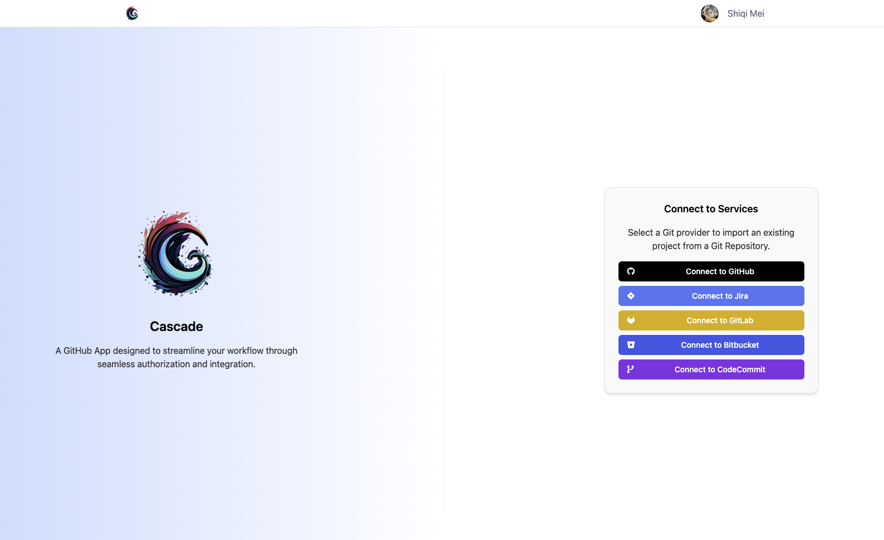
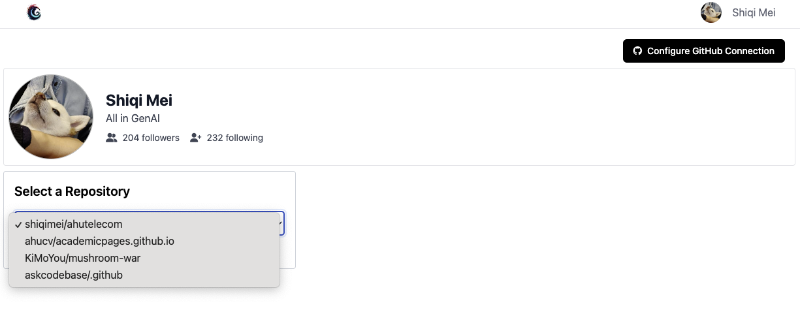

# Cascade

A GitHub App designed to streamline your workflow through seamless authorization and integration.





## Local Development

```bash
poetry install
poetry run dev
poetry run gunicorn -k geventwebsocket.gunicorn.workers.GeventWebSocketWorker -w 1 -b 0.0.0.0:8080 src.app:app

```

## Production Deployment

1. Build local docker image and preview

    ```bash
    docker build -t cascade-chat .
    docker run --env-file .env -p 8080:80 cascade-chat
    ```

2. Make sure secrets securely upload to EKS

    ```bash
    kubectl create namespace cascade-chat
    poetry run build_secret_yaml && kubectl apply -f deployment-secret.yaml
    ```

3. Push image to ECR & Deploy image on EKS

    ```bash
    aws ecr create-repository --repository-name cascade-chat
    aws ecr get-login-password --region us-west-1 | docker login --username AWS --password-stdin 544018208436.dkr.ecr.us-west-1.amazonaws.com/cascade-chat
    docker tag cascade-chat:latest 544018208436.dkr.ecr.us-west-1.amazonaws.com/cascade-chat:latest
    docker push 544018208436.dkr.ecr.us-west-1.amazonaws.com/cascade-chat:latest
    kubectl apply -f deployment.yaml
    kubectl get pods -n cascade-chat
    kubectl describe pod cascade-chat-deployment-d8dd48444-qm287 -n cascade-chat
    kubectl get svc -n cascade-chat
    ```

#### Notes

1. **For VSCode Users:** Make sure correct python interpreter is selected with `Python: Select Interpreter`.
2. Generate a new `JWT_SECRET_KEY` or `GITHUB_WEBHOOK_SECRET`, use command `poetry run secret`
3. Reverse proxy local port for testing: [pinggy.io](https://pinggy.io/)